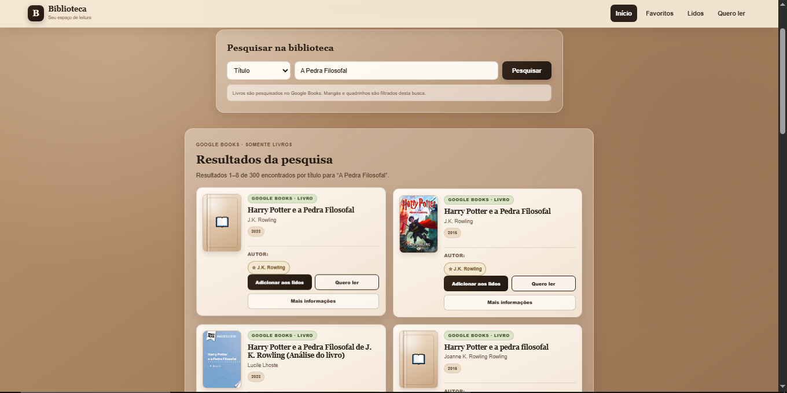

# Biblioteca pessoal

Aplicação web para pesquisar livros no Google Books e organizar uma biblioteca pessoal no navegador.



## Funcionalidades

- Pesquisa por título, autor ou busca geral.
- Resultados em português, ordenados por relevância.
- Paginação dos resultados do Google Books.
- Cadastro manual de livros.
- Listas de livros lidos e leituras planejadas.
- Favoritos de livros e autores.
- Pesquisa e ordenação nas coleções.
- Notificações com opção de desfazer algumas ações.
- Exportação e importação de backup em JSON.
- Layout responsivo para computador, tablet e celular.
- Dados salvos localmente com `localStorage`.

## Tecnologias

- HTML5
- CSS3
- JavaScript
- Google Books API
- Web Storage API (`localStorage`)

## Configuração da API

O arquivo `config.js` não é incluído no repositório para evitar o envio acidental da chave.

1. Faça uma cópia de `config.example.js` e renomeie para `config.js`.
2. Abra `config.js` e substitua o texto de exemplo pela sua chave da Google Books API.
3. Mantenha `config.js` fora do Git. O `.gitignore` já está configurado.
4. Ao publicar, restrinja a chave aos endereços do seu site e ao serviço necessário.

Exemplo do arquivo:

```js
window.GOOGLE_BOOKS_API_KEY = "SUA_CHAVE_AQUI";
```

> Uma chave usada pelo navegador pode ser visualizada pelo visitante. As restrições da chave são a proteção principal; não use uma chave sem restrições.

## Como executar

Abra a pasta no VS Code e execute `index.html` com a extensão Live Server.

Endereço comum durante o desenvolvimento:

```text
http://127.0.0.1:5500/Biblioteca/index.html
```

## Backup dos dados

Na página inicial, use **Exportar backup** para baixar um arquivo JSON com:

- livros;
- livros lidos;
- leituras planejadas;
- favoritos;
- autores favoritos.

Use **Importar backup** para restaurar um arquivo criado pelo próprio site. A importação exige confirmação e substitui os dados atuais.

## Estrutura principal

```text
Biblioteca/
├── assets/
│   └── preview.png
├── index.html
├── script.js
├── style.css
├── backup.js
├── notifications.js
├── favoritos.html
├── favoritos.js
├── lidos.html
├── lidos.js
├── planejados.html
├── planejados.js
├── config.example.js
├── .gitignore
├── README.md
└── CHECKLIST.md
```

## Armazenamento

Os dados ficam no navegador e não são sincronizados automaticamente com outros dispositivos. Limpar os dados do navegador pode apagar a biblioteca; por isso, mantenha backups recentes.

## Publicação

Por ser um site estático, o projeto pode ser publicado em serviços como GitHub Pages, Netlify ou Vercel. Antes de publicar, confira as restrições da chave e execute o checklist incluído no projeto.
